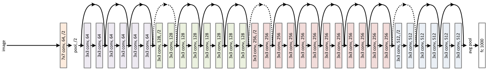
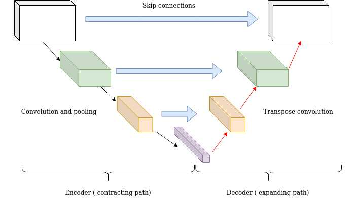

# Skip Connections 🚀



- Skip connections are a type of neural network architecture that allows for the direct flow of information between layers.

- This can help to prevent the vanishing gradient problem and allow for deeper networks to be trained.



---

## Skip connections in PyTorch 🐍

```python
import torch

class ResidualBlock(torch.nn.Module):
    def __init__(self, in_channels, out_channels):
        super(ResidualBlock, self).__init__()

        self.conv1 = torch.nn.Conv2d(in_channels, out_channels, kernel_size=3, stride=1, padding=1)
        self.conv2 = torch.nn.Conv2d(out_channels, out_channels, kernel_size=3, stride=1, padding=1)

    def forward(self, x):
        residual = self.conv1(x)
        residual = self.conv2(residual)

        out = x + residual

        return out
```

- This code creates a residual block that consists of two convolutional layers. The output of the first convolutional layer is added to the input of the second convolutional layer. This skip connection allows for the direct flow of information between the two layers.

---

## Summary:


- Skip connections can be used in a variety of different neural network architectures, including residual networks (ResNets), dense networks (DenseNets), and attention networks. 
- They are a powerful tool that can help to improve the performance and stability of neural networks.